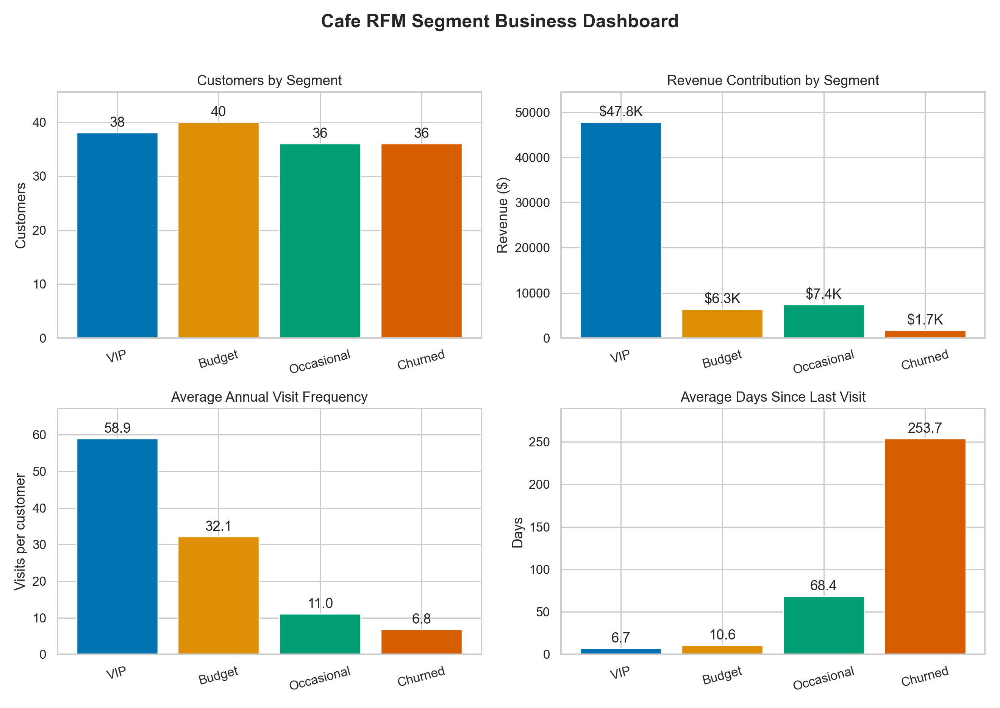

# Week 5 Customer Segmentation Report

## Executive Summary

The two case studies demonstrate the same customer-segmentation workflow at different levels of scale and uncertainty. Case Study 1 uses a controlled cafe simulation to teach RFM construction and validate whether clustering can recover known customer archetypes. Case Study 2 applies an out-of-core behavioral pipeline to the complete October-November ecommerce archive on a 24 GB MacBook Pro.

Case Study 1 selected four clearly separated segments with silhouette **0.657** and perfect recovery of the withheld simulated archetypes. Case Study 2 processed **109,950,743 events** for **697,470 purchasers** and selected three overlapping but stable behavioral segments with silhouette **0.227** and stability ARI **0.997**. The difference is expected: synthetic archetypes are deliberately distinct, while real customer behavior lies on a continuum.

## Results at a Glance

| Measure | Case 1: Cafe RFM | Case 2: Ecommerce Behavior |
|---|---:|---:|
| Observation scope | 2025 calendar year | October-November 2019 |
| Customers analyzed | 150 | 697,470 purchasers |
| Source records | 4,162 transactions | 109,950,743 events |
| Selected clusters | 4 | 3 |
| Silhouette | 0.657 | 0.227 |
| Stability ARI | 1.000 | 0.997 |
| Recorded value | $63,233 simulated revenue | 505,152,392.77 unspecified price units |

Silhouette values should not be compared as a contest between studies. The datasets, features, scale, and purpose differ substantially.

## Case Study 1: Manual Cafe Transaction Log

RFM was calculated from generated transaction records using 2026-01-01 as the reference date. The clustering model used only recency, frequency, and monetary value; archetype labels were withheld until validation.

- **VIP Daily Drinkers:** 38 customers generated 75.6% of revenue. Retention and convenience benefits are the priority.
- **Budget Students:** 40 frequent customers had a $4.95 mean transaction. Low-cost bundles can test basket growth.
- **Occasional Treaters:** 36 customers had an $18.71 mean transaction but low frequency. Occasion-based reminders can test visit growth.
- **Churned Customers:** 36 customers generated only 2.7% of revenue. Use a limited win-back experiment before further investment.

The four clusters achieved withheld-label ARI **1.000** and 100% best-match accuracy. This validates the teaching pipeline, not the assumption that real cafe customers will separate perfectly.

## Case Study 2: Programmatic Ecommerce Segmentation

DuckDB performed bounded out-of-core scans and feature aggregation, while Polars handled compact analytical tables and plotting inputs. The model combined RFM with browsing, cart, activity, category-diversity, and conversion features.

- **Engaged Repeat Shoppers:** 157,416 purchasers, or 22.6%, generated 64.2% of purchase value. Protect retention and personalize recommendations.
- **High-Value Efficient Buyers:** 295,655 purchasers generated 27.0% of value with limited browsing. Prioritize availability and checkout reliability.
- **One-Time Direct Buyers:** 244,399 purchasers generated 8.8% of value. Test category-specific second-purchase campaigns using a holdout group.

The full workflow stayed within the machine guardrails. Peak measured RSS was **6.16 GiB**, below the 14 GiB abort threshold, and all customer counts and purchase-value totals reconciled exactly.

## Management Interpretation

Both studies identify a small or medium-sized group responsible for disproportionate value. The appropriate response is not simply to discount high-value customers. Retention, convenience, availability, and relevant recommendations should be tested first. Lower-value groups require targeted experiments tied to a specific behavior, such as increasing basket size or producing a second purchase.

Clustering provides prioritization hypotheses rather than causal proof. Campaigns should use control groups and measure incremental conversion, value, margin, and retention. Case Study 2 labels should also be validated on a later observation window before operational deployment.

## Detailed Reports and Reproduction

- [Case Study 1 detailed report](case1_cafe_rfm/CAFE_RFM_REPORT.md)
- [Case Study 2 detailed report](case2_ecommerce_segmentation/ECOMMERCE_SEGMENTATION_REPORT.md)
- [Case Study 2 processing guide](case2_ecommerce_segmentation/README.md)

Every reported result is derived from the saved scripts and compact evidence under each case's `outputs/` directory. Raw and derived large-scale ecommerce data remain excluded from Git.
