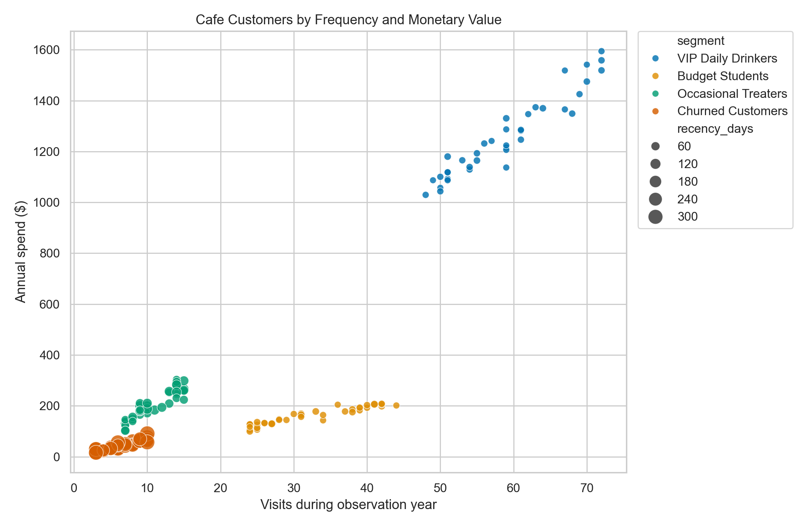
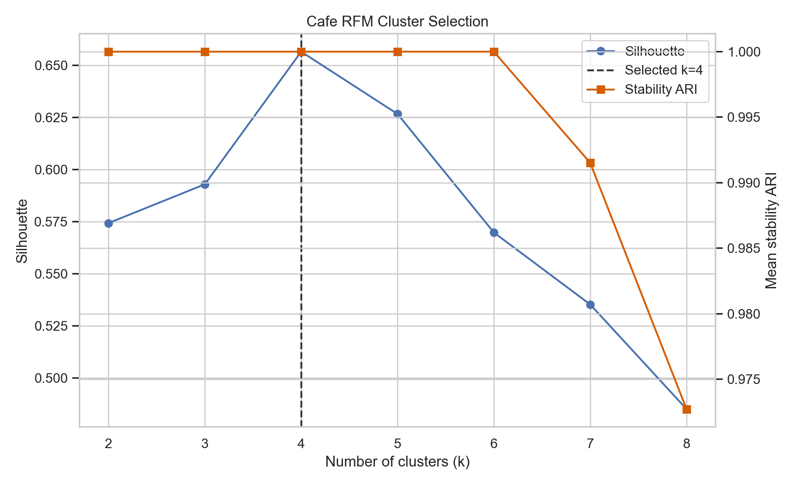
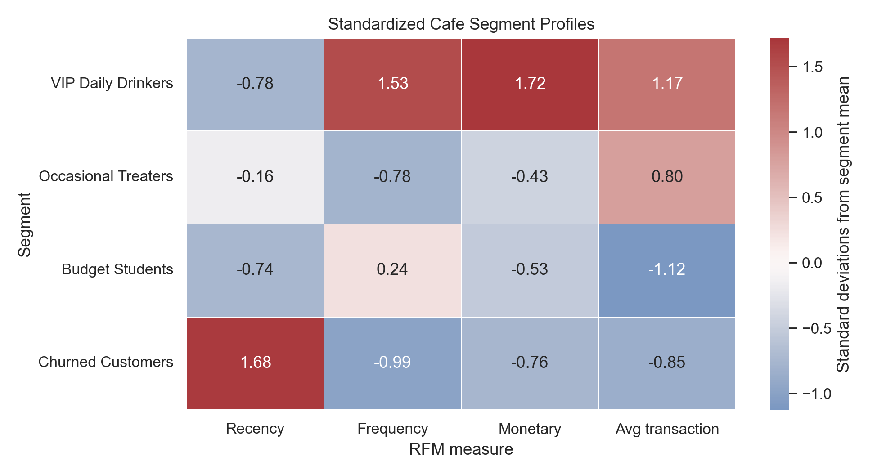

# Cafe Customer RFM Segmentation Report

## Executive Summary

The reproducible case generated **4,162 cafe visits from exactly 150 loyalty customers** and selected a four-segment RFM solution without using the source archetype labels during modeling. The selected model achieved a **0.657 silhouette score**, **1.000 stability ARI** across the configured random seeds, and a minimum segment size of 36 customers.

VIP Daily Drinkers represent 38 customers but contribute **$47,828.50, or 75.6% of the simulated $63,233.00 revenue**. Protecting this group is therefore the first commercial priority. Budget Students visit frequently but spend only $4.95 per transaction, while Occasional Treaters spend $18.71 per transaction but visit much less often. These two groups require different growth tactics.

## Data and Method

The transaction generator uses `RANDOM_SEED = 42`, a fixed menu, calendar-year 2025 visits, and four behavioral archetypes. Archetype labels are stored separately from the transaction log and are not opened until after model fitting.

RFM uses a **2026-01-01 reference date**:

- Recency: days since the customer's latest visit.
- Frequency: distinct transaction count.
- Monetary: sum of transaction basket spend.

The analysis applies `log1p` to RFM, standardizes the three features, and evaluates K-Means solutions from `k=2` through `k=8`. Candidates require at least eight customers per cluster and stability ARI of at least 0.80. Among eligible candidates, `k=4` had the highest silhouette score. Its Davies-Bouldin score was 0.494 and its Calinski-Harabasz score was 638.77.

## Segment Profiles

| Segment | Customers | Mean recency | Mean visits | Mean annual spend | Mean transaction | Revenue | Revenue share |
|---|---:|---:|---:|---:|---:|---:|---:|
| VIP Daily Drinkers | 38 | 6.71 days | 58.92 | $1,258.64 | $21.38 | $47,828.50 | 75.6% |
| Occasional Treaters | 36 | 68.36 days | 10.97 | $204.79 | $18.71 | $7,372.50 | 11.7% |
| Budget Students | 40 | 10.60 days | 32.10 | $158.62 | $4.95 | $6,345.00 | 10.0% |
| Churned Customers | 36 | 253.67 days | 6.78 | $46.86 | $6.93 | $1,687.00 | 2.7% |

## Visual Summary

The dashboard compares segment size, revenue, frequency, and recency in business units.


The customer map shows the separation in frequency and monetary value; marker size represents recency.



The candidate plot records why four clusters were selected instead of assuming the four source archetypes.



The standardized heatmap compares all segment profiles on a common scale.



## Recommended Actions

1. **Protect VIP Daily Drinkers.** Offer recognition and convenience benefits such as priority ordering or a premium meal-and-drink reward. Avoid broad discounts that unnecessarily erode the segment producing three quarters of revenue.
2. **Raise Budget Student basket value.** Test low-cost add-on bundles around drip coffee, tea, and muffins. Measure incremental gross margin rather than redemption alone.
3. **Increase Occasional Treater frequency.** Use event- or weekend-based reminders featuring premium food bundles. Their $18.71 average ticket indicates more upside from an extra visit than from discounting the basket.
4. **Test, then limit churn investment.** Churned Customers have been absent for about 254 days and generated only 2.7% of observed revenue. Use one controlled win-back test before committing ongoing promotional spend.

## Validation and Limitations

After model selection, the withheld labels produced **ARI = 1.000** and **100% best-match accuracy**; the data-derived business names also matched all 150 source archetypes. This is a ground-truth verification of a controlled teaching simulation, not evidence that real cafe customers will separate perfectly. The generated revenue is illustrative, not a forecast, and the segment actions require real-world experiments before financial claims can be made.

## Reproduction

Run from this case directory:

```bash
python3 generate.py
python3 analyze.py
```

The measured evidence is saved under `outputs/`; figures are saved under `figures/`. Any failed schema, price, customer-count, cluster-size, or stability assertion stops the workflow.
