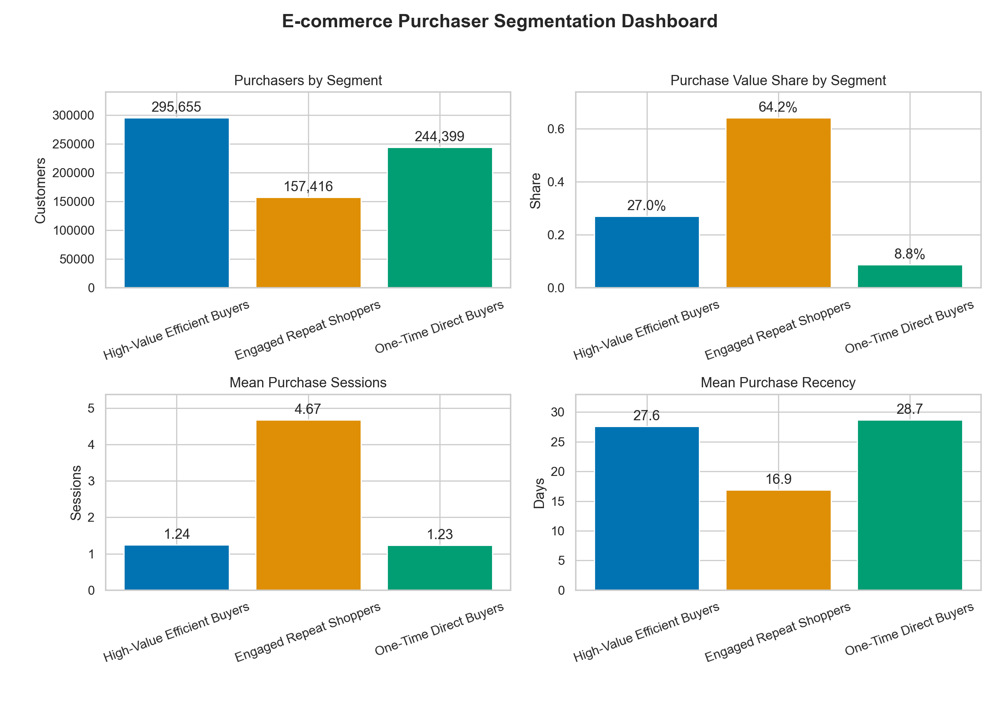
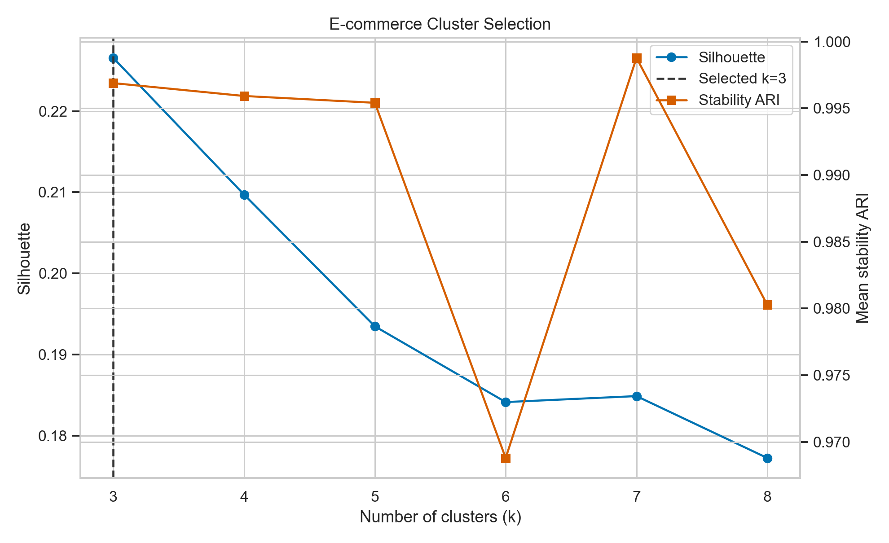

# Programmatic E-commerce Customer Segmentation Report

## Executive Summary

The October-November 2019 pipeline processed **109,950,743 ecommerce events** into behavioral features for **697,470 purchasers** without loading the raw event table into memory. A three-segment solution was selected from `k=3..8` on a fixed 100,000-customer sample and assigned to every purchaser in bounded batches.

**Engaged Repeat Shoppers are the commercial core:** 22.6% of purchasers contribute 64.2% of recorded purchase value. High-Value Efficient Buyers contribute another 27.0%. One-Time Direct Buyers represent 35.0% of purchasers but only 8.8% of value, making second-purchase conversion the clearest growth experiment.

## Source and Data Quality

The source is the [Kaggle multi-category ecommerce behavior dataset](https://www.kaggle.com/datasets/mkechinov/ecommerce-behavior-data-from-multi-category-store). The supplied archive passed a complete ZIP CRC check.

- Event period: 2019-10-01 through 2019-11-30.
- Event mix: 104,335,509 views, 3,955,446 carts, and 1,659,788 purchase lines.
- Recorded purchase value: 505,152,392.77 price units. The source does not establish a reporting currency.
- Missing category taxonomy: 35,413,780 rows (32.2%); missing brand: 15,331,243 rows (13.9%).
- Exact duplicate rows: 130,739 (0.119%). They remain because identical purchase lines may represent multiple units; no defensible quantity rule exists.
- Twelve events lack sessions, but no purchase event does. Timestamp, identifier, price, month-boundary, and purchase-session checks passed.

## Model Selection and Performance

Features cover purchase recency, purchase sessions, purchase value, average order value, views, carts, purchase items, active days, sessions, category diversity, and cart-session conversion. Nonnegative features use `log1p`, followed by incremental standardization.

K-Means model selection chose **`k=3`** with silhouette **0.227** and stability ARI **0.997**. The moderate silhouette indicates useful overlapping tendencies, not perfectly separated natural classes. MiniBatchKMeans assigned all customers. Peak measured RSS was 5.97 GiB for monthly ingestion, 6.16 GiB for combined feature aggregation, and 1.45 GiB for clustering—below the 14 GiB abort limit. Feature aggregation took 173 seconds and clustering 22 seconds.

## Segment Profiles

| Segment | Purchasers | Purchaser share | Value share | Mean purchase sessions | Mean purchase value | Mean order value | Mean recency | Mean views | Mean categories |
|---|---:|---:|---:|---:|---:|---:|---:|---:|---:|
| Engaged Repeat Shoppers | 157,416 | 22.6% | 64.2% | 4.67 | 2,059.89 | 450.65 | 16.9 days | 116.49 | 5.62 |
| High-Value Efficient Buyers | 295,655 | 42.4% | 27.0% | 1.24 | 461.85 | 376.79 | 27.6 days | 10.99 | 1.31 |
| One-Time Direct Buyers | 244,399 | 35.0% | 8.8% | 1.23 | 181.44 | 158.16 | 28.7 days | 75.22 | 4.54 |

## Visual Review

## Recommended Actions

1. **Protect Engaged Repeat Shoppers.** Use loyalty recognition, replenishment reminders, and category recommendations. Measure incentives against margin.
2. **Reduce friction for High-Value Efficient Buyers.** Prioritize stock availability, checkout reliability, and complementary premium items over blanket discounts.
3. **Test second-purchase conversion.** Send One-Time Direct Buyers a category-specific follow-up, then compare second-session conversion and incremental value with a holdout group.
4. **Investigate high browsing among one-time buyers.** Their 75.22 mean views but low purchase value may reflect research, comparison, or unresolved friction; validate before treating views as intent.

## Limitations and Next Step

This is purchaser-only segmentation over two months. Purchase events are item lines, sessions proxy for orders, and recorded price is a value proxy rather than audited revenue. Missing taxonomy constrains merchandising interpretation. Validate labels on a later-month holdout and measure campaign lift before operational deployment.

## Reproduction

Run the commands in `README.md`. Source manifests, monthly quality checks, feature reconciliation, candidate metrics, performance evidence, and profiles are under `outputs/`. Raw, processed, derived, environment, and temporary files are excluded from Git.
