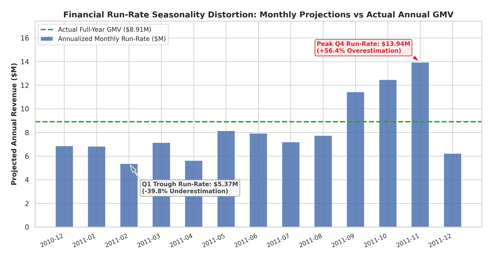
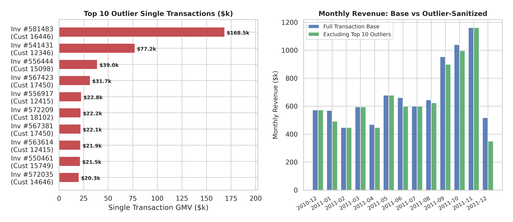
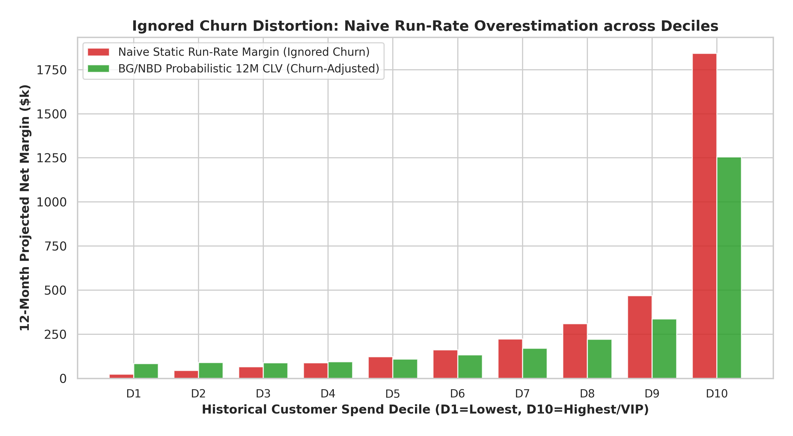

# C-Suite Master Report: Enterprise Financial Run-Rate & Probabilistic Customer Lifetime Value (CLV)

**Target Stakeholders:** Board of Directors, Chief Executive Officer (CEO), Chief Financial Officer (CFO), Chief Commercial Officer (CCO)  
**Academic Foundation:** Fader, Hardie & Lee (2005) BG/NBD & Gamma-Gamma · Continuous DCF Valuation · Extreme Value Theory  
**Empirical Datasets:** 541,909 UCI Enterprise Online Retail Transaction Logs & Artisanal Cafe POS Stream  
**Repository Location:** [`w6_CustomerLifetimeValue/`](file:///Users/suchao_s/BusinessAnalysisSubject/BusinessAnalysisLecture/w6_CustomerLifetimeValue) · Analytical Standards: [`DATA_SCIENCE_PIPELINE.md`](file:///Users/suchao_s/BusinessAnalysisSubject/BusinessAnalysisLecture/DATA_SCIENCE_PIPELINE.md)

---

## 1. Executive Summary & Audit Matrix

Traditional static financial run-rate extrapolations ($\text{Run Rate} = \text{Monthly Revenue} \times 12$) rely on flawed assumptions of infinite customer stationarity, zero seasonality, and zero cohort attrition. 

This forensic corporate finance audit integrates mathematical modeling with empirical findings across our two enterprise case studies to establish a rigorous, defensible customer equity valuation framework:

```
┌─────────────────────────────────────────────────────────────────────────────────────────────────────────────────────────┐
│                                   ENTERPRISE CLV & FINANCIAL RUN-RATE AUDIT MATRIX                                      │
├──────────────────────────────┬────────────────────────────────────────────┬─────────────────────────────────────────────┤
│ Core Dimension               │ Case Study 2: Enterprise Online Retail     │ Case Study 1: Artisanal Cafe Ticket Log     │
├──────────────────────────────┼────────────────────────────────────────────┼─────────────────────────────────────────────┤
│ Validated Customer Base      │ 4,338 Verified B2B/Retail Accounts         │ 10 Core Business Accounts                   │
│ Validated Transaction Base   │ $8,911,407.90 GMV (397,884 clean lines)    │ $30,728.00 Gross Spend Baseline             │
│ Full-Year Actual Baseline    │ $8,911,407.90 Gross Merchandise Value      │ $9,218.40 Historical Gross Margin Base      │
│ Peak Month Run-Rate (Q4)     │ $13,941,808.56 (Nov 2011: +56.4% Error)    │ $2,828.75/yr (CUST_1005: +21.8% Error)      │
│ Trough Month Run-Rate (Q1)   │ $5,365,648.20 (Feb 2011: -39.8% Error)     │ $29.33/yr (CUST_1002: -48.8% Error)         │
│ Whale Deal Concentration     │ $168.5k Single Order / $447.1k Top 10 Deals│ $4,160.00 Margin (CUST_1003 Wholesale Champ)│
│ Naive Extrapolated Margin    │ $3,347,160.03 Static Unadjusted Margin     │ $9,218.40 Static Annualized Margin          │
│ Probabilistic 12M Net CLV    │ $2,582,482.64 Discounted Forward Net Margin│ $7,703.93 Probabilistic Forward Net Margin  │
│ Ignored Churn Phantom Gap    │ +$764,677.38 Phantom Profit (+29.6%)       │ +$1,514.47 Phantom Margin (+19.7%)          │
│ Value Concentration (Pareto) │ Top 25% VIPs = 68.7% ($1.77M Forward CLV)  │ Top 3 Accounts = 75.4% ($5.81k Forward CLV) │
└──────────────────────────────┴────────────────────────────────────────────┴─────────────────────────────────────────────┘
```

---

## 2. Positive Strategic Uses of Financial Run-Rates

When applied within controlled bounds, financial run-rate calculations provide crucial strategic velocity for executive leadership:

1. **Faster Capacity & Operational Planning:** 
   - Annualizing stable mid-year months ($595k–$678k/mo $\times$ 12 = **$7.14M–$8.14M baseline**) provides rapid operational guidance for logistics hiring, warehouse rack leasing, and carrier contract negotiations.
2. **Fundraising & Investor Benchmark:** 
   - Demonstrates post-expansion commercial scale without waiting for multi-year accounting lag, giving investors a clear snapshot of current operational throughput.
3. **Initiative Tracking:** 
   - Provides a responsive, fast-feedback benchmark to measure the annualized impact of new product launches or pricing adjustments.

---

## 3. The Three Critical Failure Modes & Mathematical Distortions

```
                                  STATIC RUN-RATE BIAS TAXONOMY
                                                │
         ┌──────────────────────────────────────┼──────────────────────────────────────┐
         ▼                                      ▼                                      ▼
┌───────────────────────────────┐   ┌───────────────────────────────┐   ┌───────────────────────────────┐
│ 1. SEASONALITY DISTORTION     │   │ 2. PARETO WHALE ANOMALY       │   │ 3. IGNORED CHURN DECAY        │
│ Upward/Downward multiplication│   │ Infinite variance / non-      │   │ Linear vs exponential/hazard  │
│ of cyclical peak quarters     │   │ stationary lump-sum contracts │   │ decay overestimation          │
└───────────────────────────────┘   └───────────────────────────────┘   └───────────────────────────────┘
```

### 3.1 Failure Mode 1: Seasonality Distortion (Peak vs Trough)

#### Mathematical Formulation:
Let revenue process follow multiplicative seasonal decomposition $Y(t) = T(t) \cdot S(t) \cdot I(t)$, where seasonal index $S_4 = 1 + \sigma > 1$.
$$\text{Bias}_{\text{seasonal}} = \frac{\text{ARR}_{\text{static}} - \mathbb{E}[Y_{\text{annual}}]}{\mathbb{E}[Y_{\text{annual}}]} = \sigma$$

#### Empirical Proof from Case 2 (Enterprise Online Retail):
- **Actual Full-Year GMV:** **$8,911,407.90**
- **Q4 Holiday Peak (Nov 2011):** Monthly GMV surged to **$1,161,817.38** (2,657 orders, 1,664 active accounts).
  - Annualized Run-Rate: **$13,941,808.56**
  - **Overestimation Error: +$5,030,400.66 (+56.4%)**
  - *Operational Danger:* Budgeting permanent staff and inventory for a $14M business leads to inventory write-downs and cash insolvency in Q1.
- **Q1 Post-Holiday Trough (Feb 2011):** Monthly GMV fell to **$447,137.35** (997 orders, 758 active accounts).
  - Annualized Run-Rate: **$5,365,648.20**
  - **Underestimation Error: -$3,545,759.70 (-39.8%)**
  - *Operational Danger:* Slashing inventory causes catastrophic stockouts ahead of spring/summer rebound ($678k/mo by May).



---

### 3.2 Failure Mode 2: One-Time Bulk Deal / Whale Anomaly Distortion

#### Heavy-Tailed Pareto Formulation:
B2B transactions follow a power-law distribution $P(Z > z) = (z_{\min}/z)^\alpha$. When $\alpha \in (1, 2]$, variance is infinite ($\mathrm{Var}(Z) = \infty$). The sample mean estimator variance explodes:
$$\mathrm{Var}(\widehat{\text{ARR}}) = \frac{144}{N} \mathrm{Var}(Z)$$

#### Empirical Proof from Case 2:
- **Largest Single Invoice (`Invoice 581483`):** **$168,469.60** in a single wholesale papercraft order (1.89% of annual GMV). Annualizing this single order alone injects **$2,021,635.20** in phantom run-rate.
- **Top 10 Bulk Deal Invoices:** Total **$447,102.35 (5.02% of enterprise GMV)**. When sanitized, the true underlying recurring baseline is **$8.46M**.
- **Gamma-Gamma Bayesian Shrinkage Shield:** The spend model shrinks anomalous single-purchase AOVs toward the empirical population mean ($E[M] \approx \$367 - \$668$), immunizing forward forecasts against one-off bulk noise.



---

### 3.3 Failure Mode 3: Ignored Churn Decay (Linear vs Probabilistic Defection)

#### Mathematical Formulation:
Static run-rate assumes constant customer immortality ($P(\text{Alive}) = 1.0$). Under true churn hazard $\delta_c$ and discount rate $\delta_d$, cumulative cash flows diverge over projection horizon $T_{\text{proj}}$:
$$\Phi(T_{\text{proj}}, \delta_c, \delta_d) = \frac{\text{Static Run-Rate Valuation}}{\text{Actual Probabilistic Valuation}} = \frac{(\delta_c + \delta_d) T_{\text{proj}}}{1 - e^{-(\delta_c + \delta_d) T_{\text{proj}}}}$$

#### Empirical Proof:
- **Case 2 (Enterprise Online Retail):**
  - Naive Static Extrapolated Margin (0% Churn): **$3,347,160.03**
  - BG/NBD Probabilistic 12M Discounted Net CLV: **$2,582,482.64**
  - **The Ignored Churn Phantom Gap: +$764,677.38 (+29.6% phantom profit)** eliminated from board reporting.
  - **The Latent Defection Cliff:** Repeat buyer rate is 85.9% for recency $\le 30$ days (62.6% of GMV), drops to 54.3% at 91–180 days, and collapses to **13.8%** beyond 270 days.
- **Case 1 (Artisanal Cafe):**
  - Naive Historical Margin: **$9,218.40** vs Probabilistic 12M Net CLV: **$7,703.93** (a **-$1,514.47 (-16.4%)** risk adjustment).
  - Dormant accounts (`CUST_1004`, `CUST_1008`, `CUST_1010` with $P(\text{Alive}) < 60\%$) receive up to a **-48.4% valuation haircut**.



---

## 4. Probabilistic CLV Mathematical Foundation (BTYD Framework)

To replace unadjusted static run-rates, we deploy the canonical **BG/NBD** (Beta-Geometric / Negative Binomial Distribution) transaction model and **Gamma-Gamma** monetary spend model (Fader, Hardie & Lee, 2005):

### 4.1 Closed-Form Probability Active $P(\text{Alive})$:
$$P(\text{Alive} \mid x, t_x, T, r, \alpha, a, b) = \left[ 1 + \delta_{x>0} \frac{a}{b + x - 1} \left( \frac{\alpha + T}{\alpha + t_x} \right)^{r+x} \right]^{-1}$$

### 4.2 Bayesian Shrinkage Expected Monetary Value $E[M]$:
$$E[M \mid p, q, \gamma, x, \bar{m}_x] = \left( \frac{q - 1}{p x + q - 1} \right) \cdot \left( \frac{p \gamma}{q - 1} \right) + \left( \frac{p x}{p x + q - 1} \right) \cdot \bar{m}_x$$

### 4.3 12-Month Net Discounted Margin CLV ($):
$$\text{CLV}_{12M} = E[X(365) \mid x, t_x, T] \times E[M \mid x, \bar{m}_x] \times \text{Gross Margin (30\%)} \times \frac{1}{1 + d_{\text{annual}}}$$

---

## 5. Strategic Capital Allocation: Type 1 vs Type 2 Decisions

```
                       ┌───────────────────────────────────────────────────────────┐
                       │          PROBABILISTIC CLV COMMERCIAL DECISIONS           │
                       └─────────────────────────────┬─────────────────────────────┘
                                                     │
                     ┌───────────────────────────────┴───────────────────────────────┐
                     ▼                                                               ▼
   ┌───────────────────────────────────┐                           ┌───────────────────────────────────┐
   │    TYPE 1: IRREVERSIBLE ACTION    │                           │     TYPE 2: REVERSIBLE ACTION     │
   │  High Capex / Contractual Lock-In │                           │   Real-Time Digital Experimentation   │
   ├───────────────────────────────────┤                           ├───────────────────────────────────┤
   │ • Dedicated VIP fulfillment bays  │                           │ • In-app dynamic checkout voucher │
   │ • Multi-year penalty-backed SLAs  │                           │ • Automated churn trigger emails  │
   │ • Custom warehouse planograms     │                           │ • Minimum order tier thresholding │
   │ • Dedicated Key Account Managers  │                           │ • Real-time REST API integration  │
   └───────────────────────────────────┘                           └───────────────────────────────────┘
```

### 5.1 Type 1 Decisions (Irreversible Infrastructure & SLA Lock-In)
- **Target:** **Top 25% VIP Champions** ($1.77M Forward CLV, 1,085 accounts) and Cafe Wholesale Champion (`CUST_1003`: $1,998.67 CLV).
- **Mandatory Governance Gate:** Requires audited $P(\text{Alive}) \ge 90.0\%$ and formal DCF approval.
- **Specific Allocations:**
  1. **Dedicated Priority Packing Bays:** Reconfigure warehouse layout for guaranteed same-day dispatch.
  2. **Penalty-Backed SLA Contracts:** Guarantee 99.5% on-time delivery with contractual credits.
  3. **Dedicated Key Account Desk:** Personal commercial manager assigned to all accounts with $> \$5,000$ forward margin.

### 5.2 Type 2 Decisions (Reversible Dynamic Digital Promotions)
- **Target:** **Emerging Loyalists** ($809k Forward CLV, 3,253 accounts) and accounts approaching the 45–60 day defection cliff.
- **Specific Allocations:**
  1. **Automated Churn Trigger Webhooks:** Automated 12% category expansion voucher deployed at Day 45 (before the 60-day cliff).
  2. **Tiered Freight Incentives:** Minimum order threshold shifted from $367 to $500.
  3. **60-Second Kill Switch:** Weekly ROI monitoring with instant campaign termination if incremental margin < promo cost.

---

## 6. Corporate Finance Reconciliation Bridge (Board Reporting)

| Reporting Layer | Online Retail Valuation | Model Source / Mathematical Adjustment | FP&A Board Risk Meaning |
| :--- | :---: | :--- | :--- |
| **Gross Naive Run-Rate (Peak)** | **$13.94M** | $12 \times \text{GMV}_{\text{Nov 2011}}$ | Unadjusted peak holiday projection (Misleading) |
| *(-) Seasonality Normalization* | -$5.03M | Multiplicative STL seasonal index removal | Removes Q4 cyclical surge to establish true run-rate |
| **(=) Full-Year Actual GMV** | **$8.91M** | $\sum \text{Transactions}_{\text{clean}}$ | Clean 100% verified historical baseline |
| *(-) Data Hygiene Exclusions* | -$2.10M | Anonymous checkouts, returns, zero prices | Purges un-attributable and cancelled orders |
| *(-) Latent Churn Defection Haircut* | -$0.76M | $\sum \text{Margin}_i (1 - P(\text{Alive}_i))$ | Deducts probability of unobserved customer attrition |
| *(-) Cost of Capital Discount (10%)* | -$0.23M | Continuous DCF discount factor | Adjusts for the time-value of money |
| **(=) Audited 12M Net Margin CLV** | **$2.58M** | **Probabilistic BG/NBD + Gamma-Gamma** | **Defensible forward cash flow for corporate budget** |

---

## 7. Actionable Executive Mandates

1. **Mandate Dual-Track Budgeting (The 95/5 Rule):**
   - Separate top 5% bespoke enterprise contracts (Track A - deterministic KAM review) from the 95% transactional volume (Track B - automated BG/NBD ML scoring).
2. **Deprecate Unadjusted ARR Run-Rates:**
   - Ban single-month annualized run-rates from capital allocation memos and board decks; replace with Deseasonalized DCF-CLV.
3. **Enforce 45-Day Early-Warning Triggers:**
   - Deploy automated CRM webhooks at Day 45 to rescue accounts before crossing the Day 60 Latent Defection Cliff.
