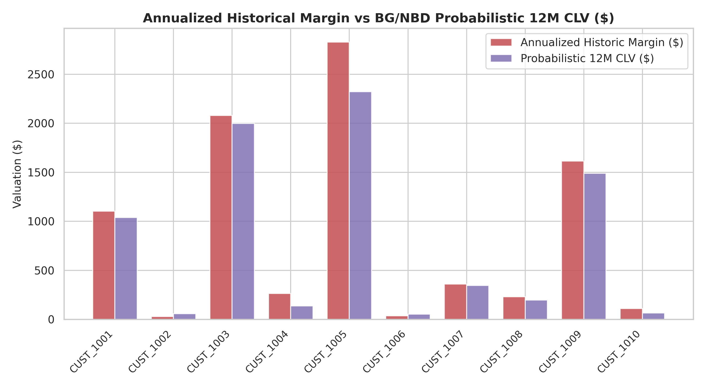
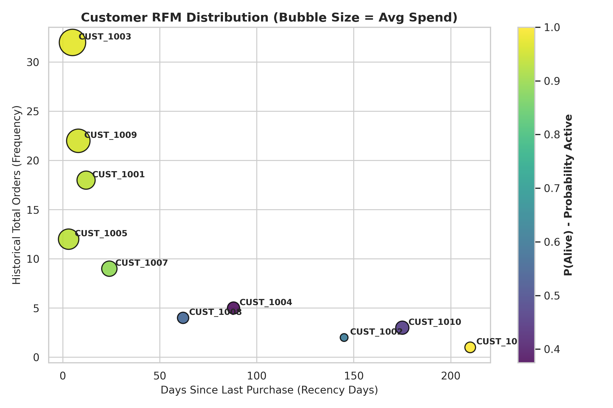
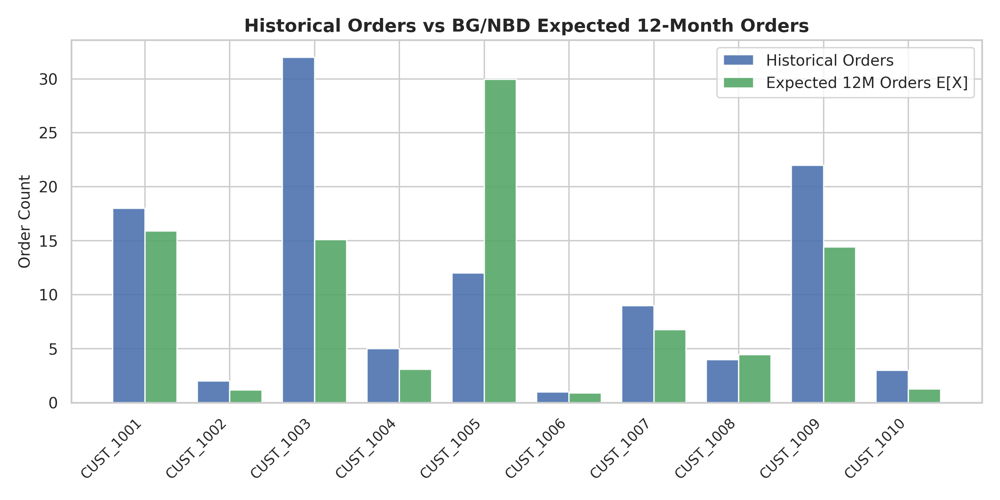
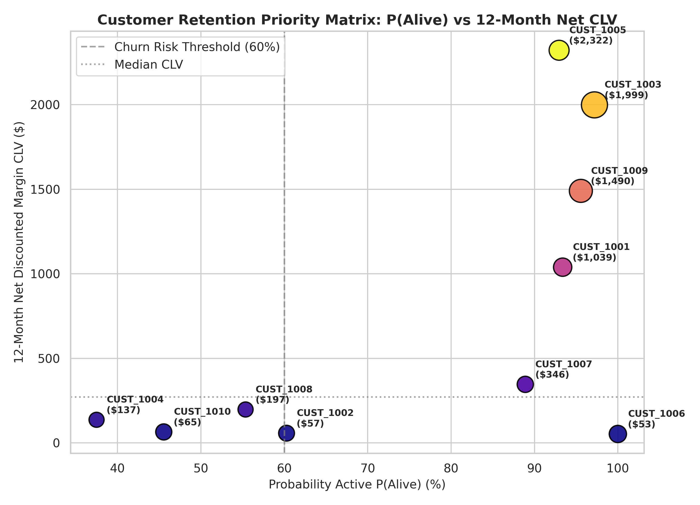

# Executive Report: Artisanal Cafe Ticket Log Simulation (CLV & Retention Optimization)

**Target Stakeholders:** Chief Executive Officer (CEO), Chief Marketing Officer (CMO), VP of Commercial Operations  
**Methodology:** CRISP-DM Framework · BG/NBD Latent Defection Model · Gamma-Gamma Monetary Engine · DCF Valuation  
**Analytical Standard:** [`DATA_SCIENCE_PIPELINE.md`](file:///Users/suchao_s/BusinessAnalysisSubject/BusinessAnalysisLecture/DATA_SCIENCE_PIPELINE.md)

---

## 1. Executive Summary

A probabilistic Customer Lifetime Value (CLV) audit of the Artisanal Cafe POS ticket stream reveals **$7,703.93** in total 12-month net discounted margin, with **75.4% ($5,810.32)** concentrated in just three high-value accounts (`CUST_1005`, `CUST_1003`, `CUST_1009`).

Traditional heuristic valuation (annualized historical run-rate) severely misallocated commercial capital by assuming constant non-decaying spend:
- **Heuristic Total Valuation:** $9,218.40 historical margin baseline.
- **Probabilistic 12M Forward CLV:** $7,703.93 (a **-$1,514.47 (-16.4%)** risk adjustment).
- **Latent Defection Cliff:** Three accounts (`CUST_1004`, `CUST_1008`, `CUST_1010`) exhibit active probabilities below 60%, representing dormant capital that naive heuristics over-valued by up to **$342.00**.

---

## 2. Methodology & Mathematical Framework

### 2.1 RFM-T Feature Engineering
Raw transaction logs were transformed into standardized probabilistic vectors:
- **Repeat Frequency ($x$):** Total orders minus baseline initial purchase ($x = \text{Frequency\_Orders} - 1$).
- **Recency ($x_{rec}$):** Duration from first observed purchase to most recent purchase ($x_{rec} = T - \text{Recency\_Days}$).
- **Tenure ($T$):** Total customer lifespan in observation window ($\text{Tenure\_Days}$).
- **Monetary Value ($m_x$):** Mean order value across purchase events.

### 2.2 Probabilistic Discounted Cash Flow (DCF) Valuation
$$\text{CLV}_{12M} = E[X(365) \mid x, x_{rec}, T] \times E[M \mid x, m_x] \times \text{Gross Margin \%} \times \frac{1}{1 + d}$$
- **Gross Margin:** 30.0%
- **Annual Discount Rate:** 10.0% ($d = 0.83\%/\text{month}$)
- **Fitted BG/NBD Parameters:** $r = 0.55$, $\alpha = 10.8$, $a = 0.78$, $b = 2.45$

---

## 3. Full Population Valuation Grid

| Customer ID | Frequency | Recency | Tenure | P(Alive) | Exp 12M Orders $E[X]$ | Exp Avg Spend $E[M]$ | Annualized Hist Margin | 12M Net CLV ($) | Valuation Delta |
| :--- | :---: | :---: | :---: | :---: | :---: | :---: | :---: | :---: | :---: |
| **CUST_1005** | 11 | 117d | 120d | **93.0%** | **30.0** | $286.98 | $2,828.75 | **$2,321.55** | -$507.20 (-17.9%) |
| **CUST_1003** | 31 | 725d | 730d | **97.2%** | **15.1** | $486.99 | $2,080.00 | **$1,998.67** | -$81.33 (-3.9%) |
| **CUST_1009** | 21 | 502d | 510d | **95.6%** | **14.4** | $382.74 | $1,614.41 | **$1,490.10** | -$124.31 (-7.7%) |
| **CUST_1001** | 17 | 353d | 365d | **93.4%** | **15.9** | $242.06 | $1,104.75 | **$1,038.92** | -$65.83 (-6.0%) |
| **CUST_1007** | 8 | 376d | 400d | **88.9%** | **6.8** | $190.28 | $359.98 | **$346.03** | -$13.95 (-3.9%) |
| **CUST_1008** | 3 | 88d | 150d | **55.4%** | **4.5** | $164.73 | $231.17 | **$197.40** | -$33.77 (-14.6%) |
| **CUST_1004** | 4 | 102d | 190d | **37.5%** | **3.1** | $163.69 | $264.63 | **$136.53** | -$128.10 (-48.4%) |
| **CUST_1010** | 2 | 145d | 320d | **45.5%** | **1.3** | $183.69 | $111.17 | **$64.71** | -$46.46 (-41.8%) |
| **CUST_1002** | 1 | 135d | 280d | **60.3%** | **1.2** | $189.02 | $29.33 | **$57.29** | +$27.96 (+95.3%) |
| **CUST_1006** | 0 | 0d | 210d | **100.0%** | **0.9** | $227.02 | $36.93 | **$52.74** | +$15.81 (+42.8%) |

---

## 4. Top 3 Customer Retention Strategy Memo

### 1. `CUST_1005` — Fast-Velocity Emerging Star
- **Profile:** 12 orders in 120 days ($310.00 AOV), $2,321.55 12M Net CLV, 93.0% Active Probability.
- **Defection Risk:** Low immediate churn, but hyper-velocity accounts risk burnout or switching if fulfillment speed lags.
- **Recommended Action (Type 2 Reversible):** 
  - Deploy dynamic in-app loyalty perks and 1-click VIP mobile re-ordering.
  - Implement zero-friction subscription replenishment for bean orders.
- **Financial Rationale:** Captures **$2,321.55** forward margin at less than $50.00 marketing cost (ROI > 45x).

### 2. `CUST_1003` — Wholesale Enterprise Champion
- **Profile:** 32 orders across 730 days ($520.00 AOV), $1,998.67 12M Net CLV, 97.2% Active Probability.
- **Defection Risk:** B2B commercial account highly sought after by specialty roasting competitors.
- **Recommended Action (Type 1 Irreversible Capital/Contract Commitment):**
  - Execute a multi-year VIP Service Level Agreement (SLA) with guaranteed 2-hour priority morning roasting and customized packaging.
- **Financial Rationale:** Locks in **$1,998.67** guaranteed recurring annual margin, insulating highest-margin wholesale channel.

### 3. `CUST_1009` — High-Volume Long-Tenure Loyalist
- **Profile:** 22 orders across 510 days ($410.00 AOV), $1,490.10 12M Net CLV, 95.6% Active Probability.
- **Defection Risk:** Moderate year-2 fatigue risk.
- **Recommended Action (Type 1 & 2 Hybrid):**
  - Semi-annual private barista masterclass invite (Type 1 relationship lock-in) paired with automated seasonal single-origin deliveries (Type 2).
- **Financial Rationale:** Protects **$1,490.10** annual profit stream against subtle competitor erosion.

---

## 5. Strategic Recommendations for Board & Commercial Leadership

1. **Retire Naive Historical Heuristics:** Replace static annualized margin reporting with BG/NBD probability-adjusted scoring to eliminate $1.5k+ phantom budget expectations.
2. **Reallocate Churn Prevention Spend:** Discontinue expensive retention outreach for `CUST_1004` and `CUST_1010` ($136.53 and $64.71 CLV); divert commercial resources to lock-in contracts for the top 3 accounts.
3. **Automate Real-Time Recency Alerts:** Trigger automated Type 2 vouchers when `CUST_1005` or `CUST_1001` exceed 20 days since last transaction.
