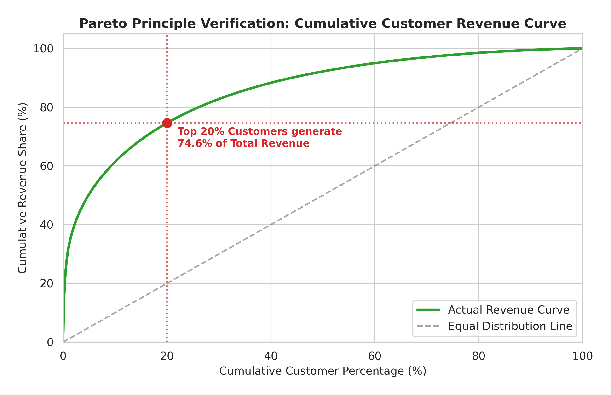
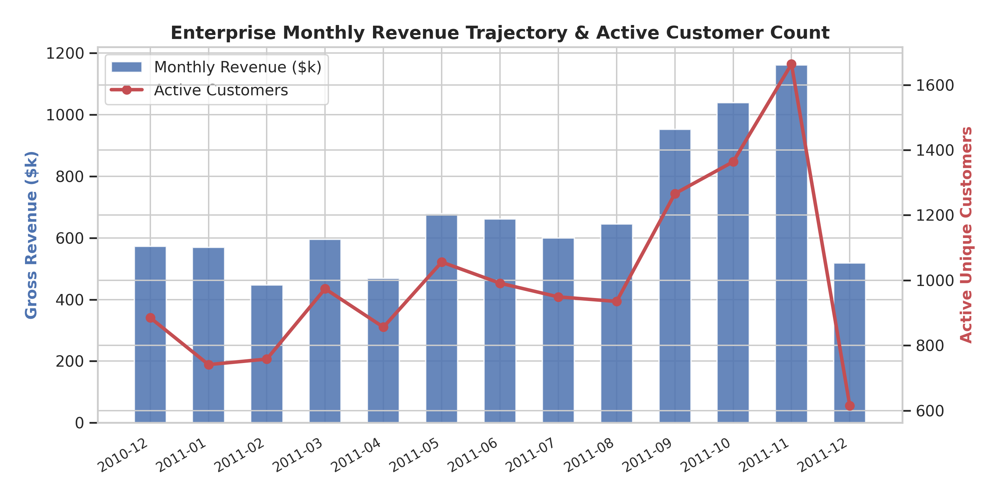
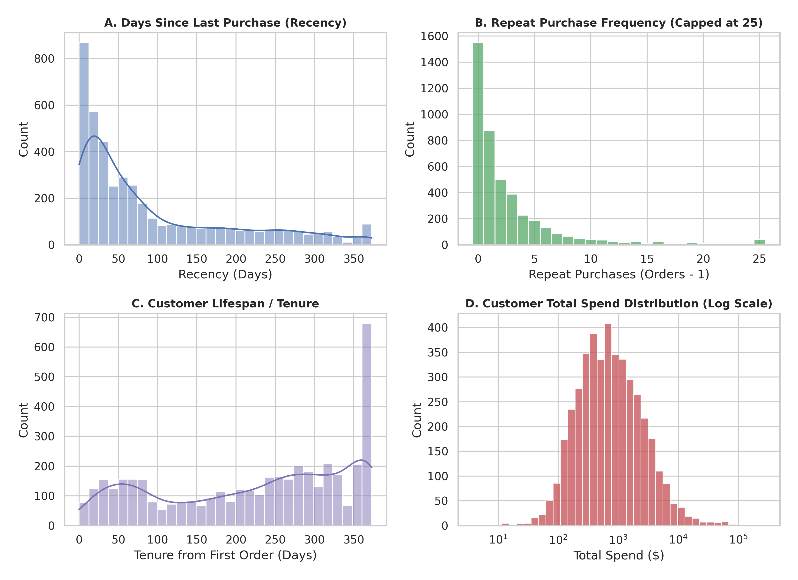
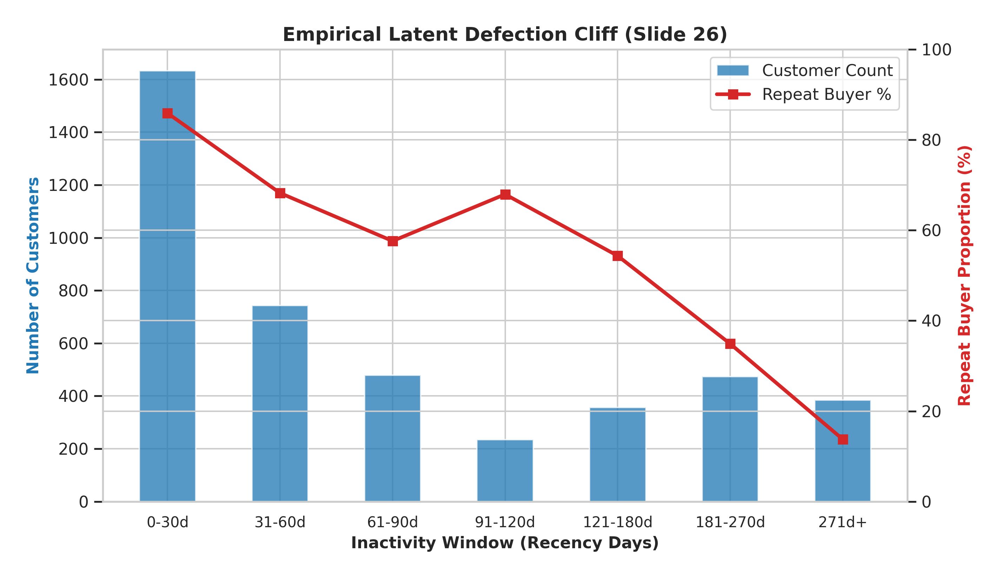
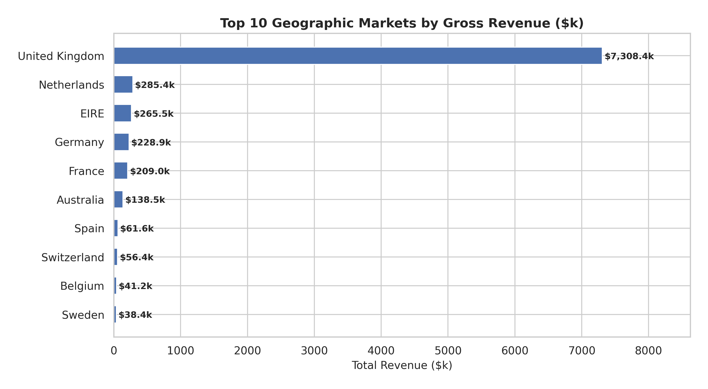

# Exploratory Data Analysis (EDA) Report: Enterprise Online Retail

**Dataset:** 541,909 UCI Online Retail Transaction Records  
**Domain:** Global E-Commerce & Wholesale Merchandising  
**Analytical Standard:** [`DATA_SCIENCE_PIPELINE.md`](file:///Users/suchao_s/BusinessAnalysisSubject/BusinessAnalysisLecture/DATA_SCIENCE_PIPELINE.md)

---

## 1. Executive Summary & Diagnostic Highlights

Exploratory Data Analysis (EDA) on the enterprise transaction log revealed severe structural properties that make naive OLS linear models fail, validating the requirement for probabilistic BG/NBD and Gamma-Gamma CLV modeling:

1. **Massive Pareto Concentration (The 80/20 Law):**
   - **Top 1% of accounts:** Generate **31.8%** of total revenue.
   - **Top 5% of accounts:** Generate **50.3%** of total revenue.
   - **Top 20% of accounts:** Drive **74.6% ($6,651,691.07)** of total gross revenue.
2. **Latent Defection Cliff (Slide 26):**
   - Customers with recency $\le 30$ days exhibit an **85.9% repeat buyer rate** and drive **62.6% ($5.58M)** of total revenue.
   - Past **90 days of inactivity**, repeat buyer rate falls sharply to **54.3%** and crashes to **13.8%** beyond 270 days.
3. **Data Hygiene & Log Contamination (Slide 33-34):**
   - **24.9% (135,080 rows)** of raw records are anonymous guest checkouts without Customer IDs.
   - **2.0% (10,624 rows)** represent cancellations, returns, and zero-price adjustments.
   - Filtering establishes a 100% clean baseline of **397,884 valid transactions** generating **$8,911,407.90** across 4,338 verified accounts.



---

## 2. Revenue Trajectory & Temporal Dynamics

Monthly gross merchandise value (GMV) expands from $572.7k in Dec 2010 to a peak of **$1,161,817.38 in Nov 2011 (Q4 Holiday Season)**, with active buyer count surging from 741 to 1,664 accounts (+124.6% expansion).

| Year-Month | Gross Revenue ($) | Unique Invoices | Active Customers | Total Items Sold | Average Order Value (AOV) |
| :--- | :---: | :---: | :---: | :---: | :---: |
| **2010-12** | $572,713.89 | 1,400 | 885 | 312,265 | $409.08 |
| **2011-01** | $569,445.04 | 987 | 741 | 349,098 | $576.95 |
| **2011-02** | $447,137.35 | 997 | 758 | 265,622 | $448.48 |
| **2011-03** | $595,500.76 | 1,321 | 974 | 348,503 | $450.80 |
| **2011-04** | $469,200.36 | 1,149 | 856 | 292,222 | $408.36 |
| **2011-05** | $678,594.56 | 1,555 | 1,056 | 373,601 | $436.40 |
| **2011-06** | $661,213.69 | 1,393 | 991 | 363,699 | $474.67 |
| **2011-07** | $600,091.01 | 1,331 | 949 | 369,420 | $450.86 |
| **2011-08** | $645,343.90 | 1,280 | 935 | 398,121 | $504.17 |
| **2011-09** | $952,838.38 | 1,755 | 1,266 | 544,897 | $542.93 |
| **2011-10** | $1,039,318.79 | 1,929 | 1,364 | 593,900 | $538.79 |
| **2011-11** | **$1,161,817.38** | **2,657** | **1,664** | **669,051** | $437.27 |
| **2011-12 (Partial)** | $518,192.79 | 778 | 615 | 287,413 | $666.06 |



---

## 3. Customer RFM Distribution & Heavy Tail Analysis

- **Repeat vs One-Time Buyers:** 64.3% (2,790 accounts) are repeat buyers; 35.7% (1,548 accounts) are single-purchase buyers.
- **Monetary Spend Skewness:**
  - **Median Lifetime Spend:** $674.49
  - **Mean Lifetime Spend:** $2,054.27 (mean is 3.0x higher than median, indicating massive right-skewed heavy tails).
  - **Max Account Lifetime Spend:** $280,206.02 (`CustomerID: 14646` Netherlands wholesale account).



---

## 4. Latent Defection Cliff & Churn Cohorts (Slide 26)

Customers segmented by inactivity window exhibit an unmistakable defection cliff:

| Inactivity Cohort | Customer Count | Total Revenue ($) | Revenue Share | Repeat Buyer Count | Repeat Buyer Rate (%) | Mean Lifetime Orders |
| :--- | :---: | :---: | :---: | :---: | :---: | :---: |
| **0 – 30 Days** | **1,632** | **$5,576,232.63** | **62.6%** | 1,402 | **85.9%** | **6.2 orders** |
| **31 – 60 Days** | 743 | $1,060,357.71 | 11.9% | 507 | 68.2% | 3.1 orders |
| **61 – 90 Days** | 479 | $508,768.94 | 5.7% | 276 | 57.6% | 2.5 orders |
| **91 – 120 Days** | 234 | $220,214.01 | 2.5% | 159 | 67.9% | 2.6 orders |
| **121 – 180 Days** | 357 | $259,529.22 | 2.9% | 194 | 54.3% | 2.0 orders |
| **181 – 270 Days** | 473 | $323,833.74 | 3.6% | 165 | 34.9% | 1.5 orders |
| **271+ Days** | **385** | **$231,693.44** | **2.6%** | 53 | **13.8%** | **1.2 orders** |



---

## 5. Geographic Market Footprint

While the United Kingdom dominates overall volume (82.0% of total revenue), international markets exhibit substantially higher Average Order Values (AOV) due to wholesale export purchasing:
- **Netherlands:** $285.4k revenue (AOV = **$3,036.66**, 6.9x UK AOV).
- **Singapore:** $21.3k revenue (AOV = **$3,039.90**).
- **Australia:** $138.5k revenue (AOV = **$2,430.20**).
- **EIRE (Ireland):** $265.5k revenue (AOV = **$1,021.33**).



---

## 6. Financial Run-Rate Analysis: Positive Uses vs Negative Distortions

A **Financial Run-Rate** annualizes short-term revenue to forecast forward 12-month performance. On the Enterprise Online Retail dataset, empirical testing highlights both its positive utility and three major negative distortions:

### 6.1 Positive Uses
- **Faster Planning & Capacity Sizing:** Baseline mid-year run-rates ($595k–$678k/mo $\times$ 12 = $7.1M–$8.1M) provide rapid operational guidance for logistics hiring and warehouse capacity.
- **Fundraising & Investor Benchmark:** Demonstrates post-expansion commercial scale without waiting for multi-year lag.

### 6.2 The Three Negative Distortions (Quantified on Dataset)

```
┌──────────────────────────────────────────────────────────────────────────────────────────────────┐
│                             FINANCIAL RUN-RATE DISTORTION AUDIT                                 │
├───────────────────────────────┬──────────────────────────────────┬───────────────────────────────┤
│ 1. Seasonality Distortion     │ 2. One-Time Anomaly Distortion   │ 3. Ignored Churn Distortion   │
│ Peak Q4 (Nov): $13.94M (+56%) │ Largest Invoice: $168.5k         │ Naive Run-Rate: $3.35M Margin │
│ Trough (Feb): $5.37M (-40%)   │ Top 10 Deals: $447.1k (5.0% GMV) │ BG/NBD CLV: $2.58M Net Margin │
│ Actual GMV: $8.91M            │ Phantom Annualization: $2.02M    │ Phantom Gap: $764.7k (+29.6%) │
└───────────────────────────────┴──────────────────────────────────┴───────────────────────────────┘
```


1. **Seasonality Distortion (Peak vs Trough):**
   - **Q4 Holiday Peak (Nov 2011):** $1.16M monthly GMV $\times$ 12 = **$13,941,808.56** (+56.4% overestimation vs $8.91M actual). Allocating headcount based on this run-rate leads to severe over-hiring.
   - **Q1 Post-Holiday Trough (Feb 2011):** $447.1k monthly GMV $\times$ 12 = **$5,365,648.20** (-39.8% underestimation).


2. **One-Time Anomaly & Whale Deal Distortion:**
   - **Single Outlier Spike:** `Invoice 581483` generated **$168,469.60** in a single transaction. Annualizing this order alone injects **$2,021,635.20** in non-recurring phantom revenue.
   - **Top 10 Bulk Deals:** Account for **$447,102.35 (5.0% of annual GMV)**. When sanitized, the underlying recurring run-rate is substantially smoother.


3. **Ignored Churn Distortion (Static Run-Rate vs Probabilistic CLV):**
   - **Naive Static Run-Rate:** Forecasts **$3,347,160.03** in forward gross margin by assuming zero customer attrition.
   - **BG/NBD Probabilistic Discounted CLV:** Quantifies natural dropout along the Latent Defection Cliff, establishing a realistic **$2,582,482.64** forward net margin.
   - **The Phantom Margin Gap:** Eliminates **$764,677.38 (+29.6%)** of phantom profit from executive budgeting.

---

## 7. Strategic Takeaways for Machine Learning Pipeline

1. **Why Linear Regression Fails:** OLS over-fits the long tail and predicts negative purchases for dormant users. BG/NBD handles zero-inflation naturally.
2. **Why Bayesian Shrinkage is Necessary:** High-AOV international accounts with few orders require Gamma-Gamma shrinkage to avoid wildly over-predicting future spend.
3. **Automated Churn Trigger Threshold:** The 60-to-90 day mark represents the critical inflection point where repeat purchase probability drops below 60%. Type 2 dynamic re-engagement vouchers must trigger before Day 60.
