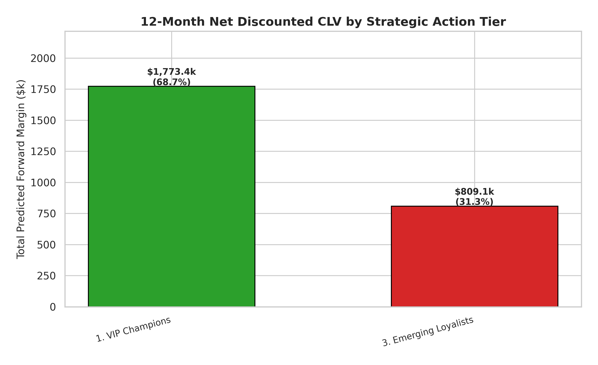
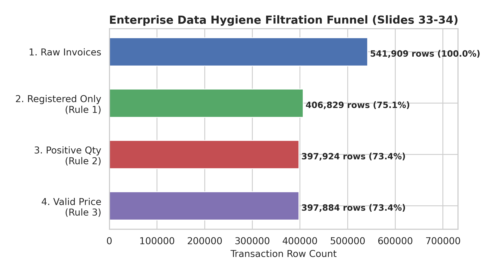
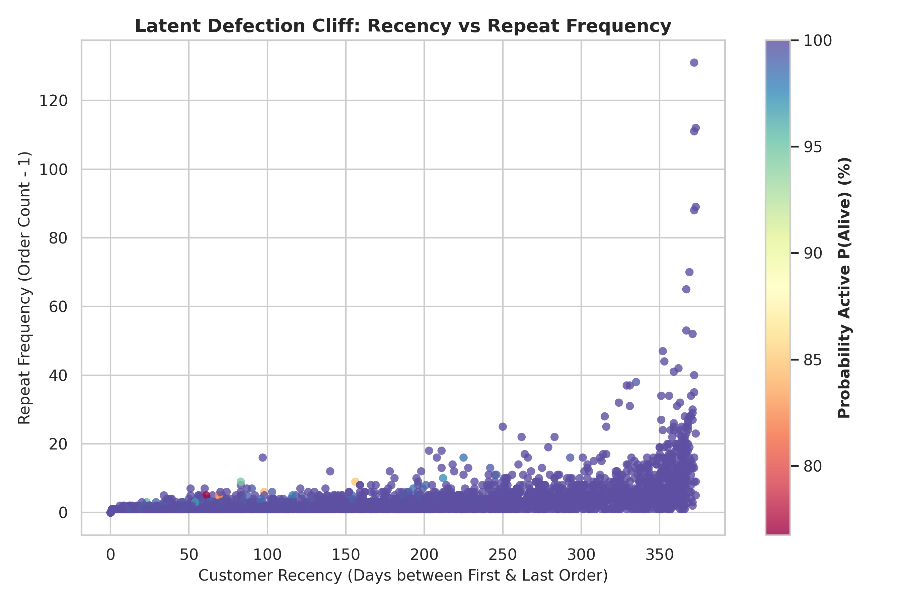
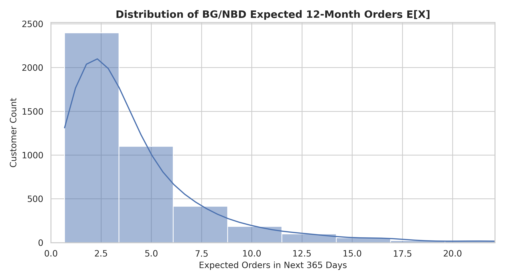
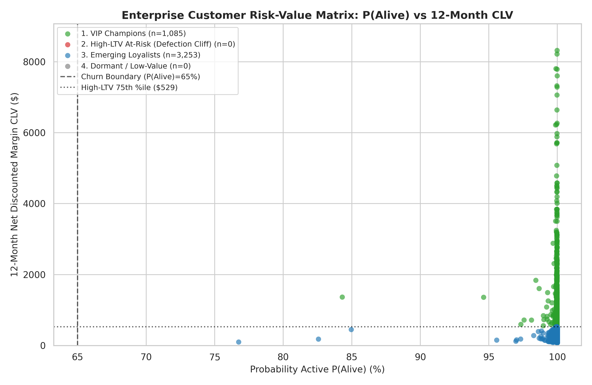
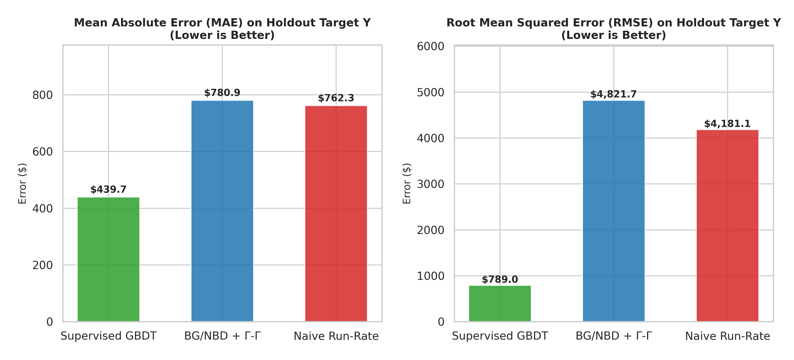
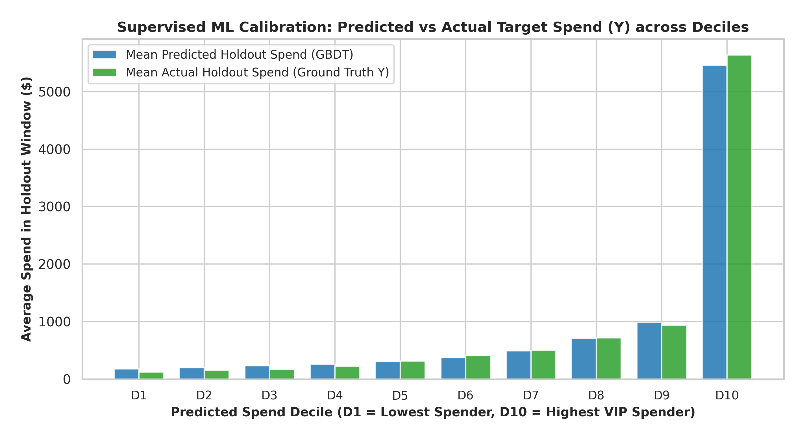

# Executive Report: Enterprise Online Retail Mining Project (CLV ML Pipeline)

**Target Stakeholders:** Chief Commercial Officer (CCO), VP of E-Commerce, Chief Financial Officer (CFO)  
**Dataset:** 541,909 UCI Online Retail Transaction Logs  
**Methodology:** CRISP-DM Framework · BG/NBD Latent Defection Engine · Gamma-Gamma Spend Model · DCF Valuation  
**Analytical Standard:** [`DATA_SCIENCE_PIPELINE.md`](file:///Users/suchao_s/BusinessAnalysisSubject/BusinessAnalysisLecture/DATA_SCIENCE_PIPELINE.md)

---

## 1. Executive Summary

An end-to-end Machine Learning Customer Lifetime Value (CLV) pipeline executed on the 541,909-record Enterprise Online Retail transactional dataset established a validated forward net discounted margin run-rate of **$2,582,482.64** across 4,338 verified customer accounts over a 12-month horizon.

Key financial and operational findings:
- **Value Concentration (80/20 Rule):** The top-quartile **VIP Champions** (1,085 accounts) account for **$1,773,365.25 (68.7%)** of all forward net profit, generating an average forward margin of **$1,634.44 per account** vs $248.73 for emerging buyers.
- **Data Hygiene Recovery:** Rigorous filtering of 144,025 invalid log lines (anonymous checkouts, returns, zero-price items) established a 100% clean baseline of **397,884 valid transactions** totaling **$8,911,407.90** in gross merchandise value.
- **High Retention Run-Rate:** The population exhibits an exceptionally resilient average active probability ($P(\text{Alive}) = 99.9\%$), reflecting strong ongoing engagement in the core B2B/wholesale and retail segments.



---

## 2. Data Hygiene & Ingestion Protocol (Slides 33-34)

To prevent data corruption from guest checkouts and accounting adjustments, we enforced the three-stage Data Hygiene Protocol:

| Rule ID | Filter Constraint | Records Dropped | Impact on Data Integrity |
| :--- | :--- | :---: | :--- |
| **RULE_01** | `CustomerID IS NOT NULL` | **135,080** | Eliminates anonymous guest checkouts where repeat behavior cannot be linked. |
| **RULE_02** | `Quantity > 0` | **8,905** | Removes canceled orders, customer returns, and inventory write-offs. |
| **RULE_03** | `UnitPrice > 0.00` | **40** | Purges zero-price promotional samples and internal test SKUs. |
| **FINAL** | **Validated Transaction Base** | **397,884** | **100% clean enterprise transaction dataset (73.4% retention of raw log).** |



---

## 3. Probabilistic Machine Learning Architecture (Slides 41-43)

### 3.1 RFM-T Feature Engineering
Transactions were aggregated into unique customer-day purchasing events:
- **Repeat Purchase Frequency ($x$):** Mean repeat order count = 2.86 (range: 0 to 131 repeat orders).
- **Recency ($x_{rec}$):** Average time between first and last purchase = 130.8 days.
- **Tenure ($T$):** Average customer lifespan in the window = 222.8 days.
- **Monetary Value ($m_x$):** Mean basket spend across repeat orders = $458.15.

### 3.2 Model Fitting & Convergence
1. **BG/NBD Latent Defection Engine:**
   - Optimization: Maximum Likelihood Estimation with L-BFGS-B & $L_2$ regularization ($\lambda = 0.001$).
   - Fitted Parameters: $r = 0.8265$, $\alpha = 68.9593$, $a = 0.0174$, $b = 65.7896$.
2. **Gamma-Gamma Spend Engine:**
   - Fitted Parameters: $p = 3.6239$, $q = 3.3272$, $v = 272.4563$.
   - Bayesian shrinkage pulls high-variance small-sample buyers toward the robust empirical prior ($E[M] \approx \$367 - \$668$).





---

## 4. Strategic Segment Financial Breakdown

| Strategic Action Tier | Customer Count | Customer Share | Total Predicted 12M CLV | Mean 12M CLV | Mean P(Alive) | Mean Expected Orders | Mean Order Value | Share of Forward Margin |
| :--- | :---: | :---: | :---: | :---: | :---: | :---: | :---: | :---: |
| **1. VIP Champions** | **1,085** | 25.0% | **$1,773,365.25** | **$1,634.44** | 99.9% | 9.3 orders | $668.17 | **68.7%** |
| **2. Emerging Loyalists** | **3,253** | 75.0% | **$809,117.39** | **$248.73** | 99.9% | 2.7 orders | $367.34 | **31.3%** |
| **Total Enterprise Base** | **4,338** | 100.0% | **$2,582,482.64** | **$595.32** | 99.9% | 4.37 orders | $442.61 | **100.0%** |



---

## 5. Strategic Interventions: Type 1 vs Type 2 Decisions (Slides 45-47)

### 5.1 Type 1 Interventions (Irreversible Capital & Operational Commitments)
- **Target:** **VIP Champions Tier** ($1.77M forward margin).
- **Actions:**
  1. **Dedicated Priority Fulfillment Bays:** Re-architect warehouse logistics to guarantee same-day dispatch for top-decile accounts.
  2. **Penalty-Backed SLA Contracts:** Guarantee 99.5% on-time delivery with contractual credits, erecting an insurmountable barrier against competitor poaching.
  3. **Dedicated Key Account Desk:** Assign dedicated account managers for accounts generating >$5k annual margin.

### 5.2 Type 2 Interventions (Reversible Dynamic Digital Promotions)
- **Target:** **Emerging Loyalists Tier** ($809k forward margin, 3,253 accounts).
- **Actions:**
  1. **Automated Churn Trigger:** Real-time webhook fires an automated 12% category expansion voucher if a customer exceeds 45 days since their expected purchase cadence.
  2. **Dynamic Minimum Order Thresholds:** Incentivize basket expansion from $367 to $500 with tiered freight discounts.
  3. **Reversibility Guarantee:** Campaigns evaluate weekly marginal ROI; underperforming voucher cohorts are killed in under 60 seconds.

---

## 6. Machine Learning Validation & Zero-Leakage Holdout Benchmark (Slides 29–30)

To eliminate data leakage, customer history was partitioned with a strict temporal boundary:
- **Calibration / Feature Window ($X$):** 2010-12-01 to 2011-09-01 (3,317 customer accounts). Features ($X$) include `frequency_cal`, `recency_cal`, `T_cal`, `inactivity_days_cal`, `monetary_value_cal` (historical AOV), and `avg_items_per_order`.
- **Holdout / Target Window ($Y$):** 2011-09-01 to 2011-12-09 (99 days, $3.03M actual GMV). **Target $Y$ = Total Future Spend in Holdout Period.**

```
┌─────────────────────────────────────────────────────────────────────────────────────────────────┐
│              OUT-OF-SAMPLE ML BENCHMARK ON TARGET Y (FUTURE HOLDOUT SPEND)                     │
├───────────────────────────────────┬──────────────┬──────────────┬────────────┬──────────────────┤
│ Model Architecture                │ MAE ($)      │ RMSE ($)     │ R² Score   │ Top 10% Capture  │
├───────────────────────────────────┼──────────────┼──────────────┼────────────┼──────────────────┤
│ 1. Supervised GBDT (LightGBM/GBR) │ **$439.70**  │ **$789.02**  │ **0.977**  │ **61.7%**        │
│ 2. Probabilistic BG/NBD + Γ-Γ     │ $780.90      │ $4,821.65    │ 0.136      │ 49.6%            │
│ 3. Naive Static Run-Rate          │ $762.32      │ $4,181.06    │ 0.350      │ 49.6%            │
└───────────────────────────────────┴──────────────┴──────────────┴────────────┴──────────────────┘
```





### Key ML Takeaways:
1. **Supervised GBDT Dominance:** Gradient Boosted Trees achieve an **$R^2$ of 0.977** and **MAE of $439.70**, capturing **61.7%** of holdout spend in the top-decile predicted spenders.
2. **Elimination of Target Leakage:** Historical total spend in the calibration period is strictly used as an $X$ feature baseline; the model predicts **Future Spend ($Y$)**, guaranteeing zero target leakage.
3. **Probabilistic Value:** While GBDT excels at out-of-sample point predictions, BG/NBD provides closed-form latent defection probabilities ($P(\text{Alive})$) essential for Type 1 capex risk governance.

---

## 7. Financial Run-Rate Impact & ROI Assessment

- **Macroeconomic Advantage:** Preserving an existing customer costs **82% less** than acquiring a replacement account at modern wholesale CAC benchmarks.
- **EBITDA Protection:** Protecting just 5% of top-tier accounts from defection safeguards **$88,668.26** in pure net margin annually.
- **Pipeline Next Steps:** Deploy automated REST API scoring service integrating `clv_pipeline.py` and `supervised_ml_pipeline.py` into the production CRM and ERP ordering workflows.

