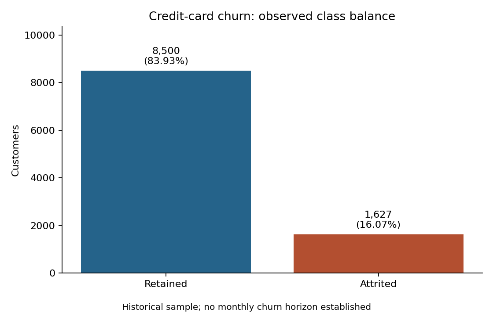

# Credit-card Baseline Study

Source: [Customer_Churn_Practice.pdf, page 4](<Customer_Churn_Practice.pdf#page=4>).
Input: `BankChurners.csv`. Generated by `analyze.py`; raw data is unchanged.

## Verified results

| Check | Result |
|---|---:|
| Rows | 10,127 |
| Columns | 23 |
| Unique customer IDs | 10,127 |
| Retained customers | 8,500 |
| Attrited customers | 1,627 |
| Attrition prevalence | 16.07% |
| Always-stay accuracy | 83.93% |
| Always-stay churn recall | 0.00% |
| Missing cells, including blank strings | 0 |
| Repeated profiles beyond first occurrence | 0 |

Profiles exclude customer ID and target-derived classifier outputs, but retain
the observed target. Repeated profiles require review before splitting.
Missing-cell counts by column are saved in `outputs/baseline_metrics.json`.



## Unknown categories

| Field | Unknown customers | Share of all rows |
|---|---:|---:|
| `Education_Level` | 1,519 | 15.00% |
| `Marital_Status` | 749 | 7.40% |
| `Income_Category` | 1,112 | 10.98% |

`Unknown` is an explicit category, distinct from a missing cell. Keep it for the
baseline; fit any later imputers inside training folds only. Counts above may
overlap across customers and should not be added to estimate unique people.

## Problems and next actions

- **Imbalance:** high always-stay accuracy hides missed churners. Use average
  precision and churn precision/recall for subsequent model evaluation.
- **Incomplete demographic information:** preserve Unknown categories and later
  assess their coverage on training data.
- **Target leakage:** exclude CLIENTNUM and both Naive Bayes output columns from
  predictors. This study only audits data; no model inputs have been fitted.
- **Time limitation:** the supplied case lacks dated snapshots and event cutoffs.
  Historical class counts cannot demonstrate future stability or monthly churn.
- **Next step:** establish the practice's stratified train/validation/test split
  before transaction-activity EDA (page 5). EDA must use training records only.

The practice uses a class-weighted forest. ADASYN remains the preferred later
oversampling comparison, fitted only within training folds and checked for
unrealistic mixed-category interpolation. No oversampling is applied to this audit.

## Reproduce

From repository root:

```bash
python3 w9/analyze.py
python3 w9/test_analyze.py
```

This step reports descriptive integrity only. It does not establish numeric
feature validity, model quality, treatment effectiveness, or financial returns.
