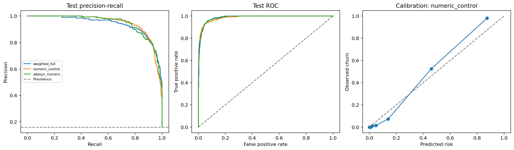
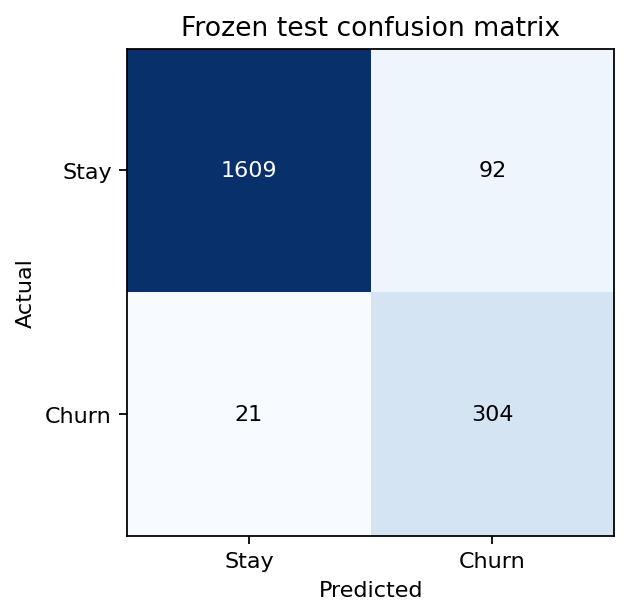
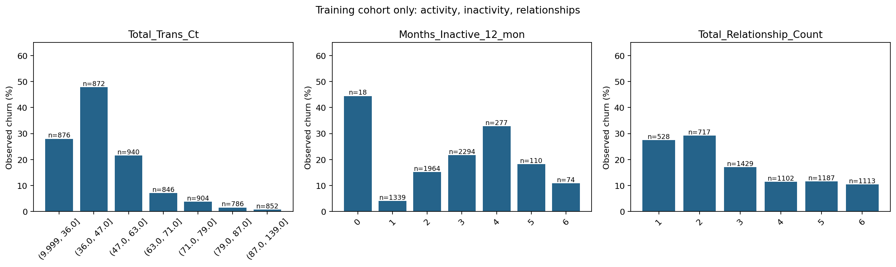
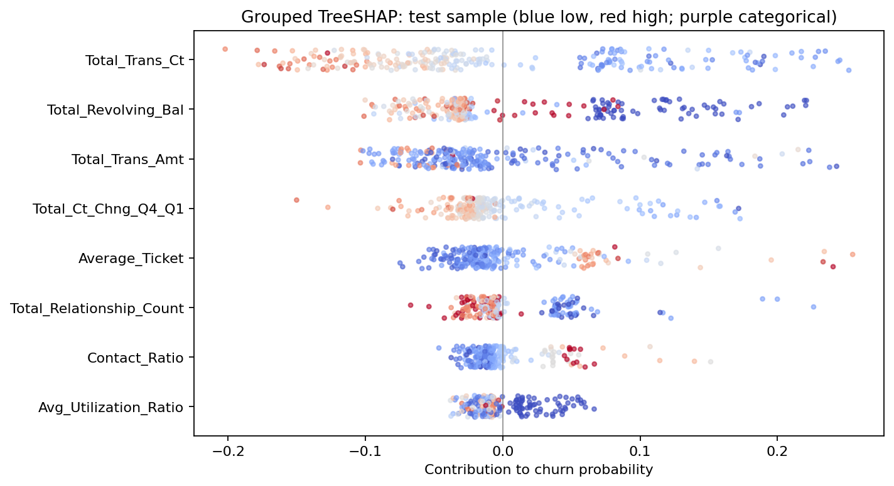
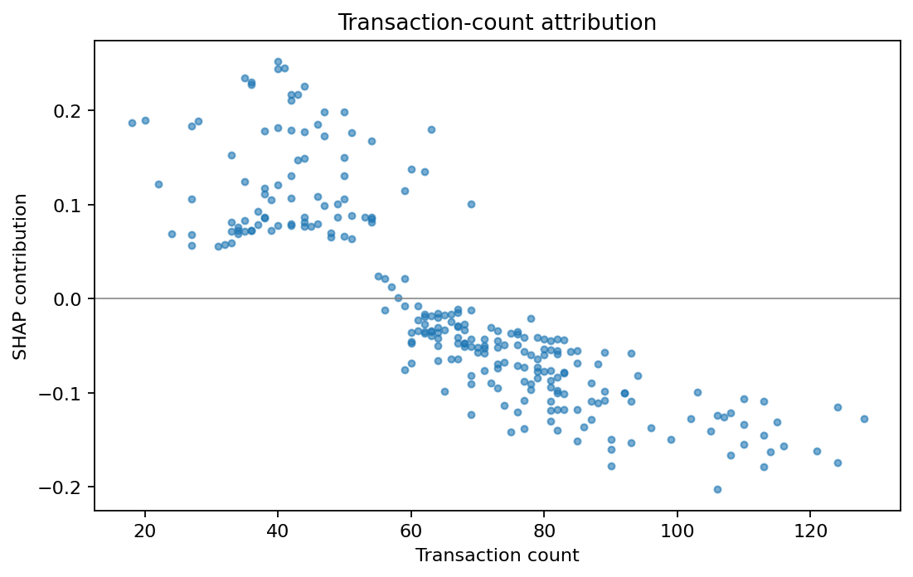
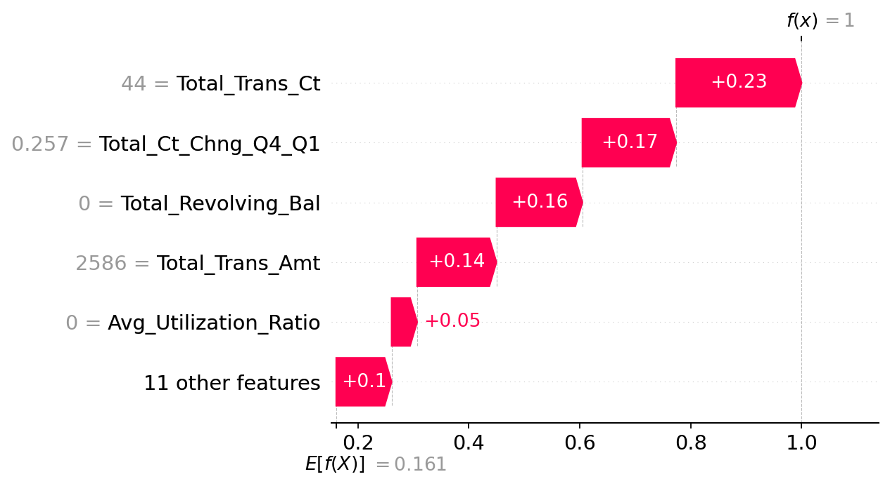
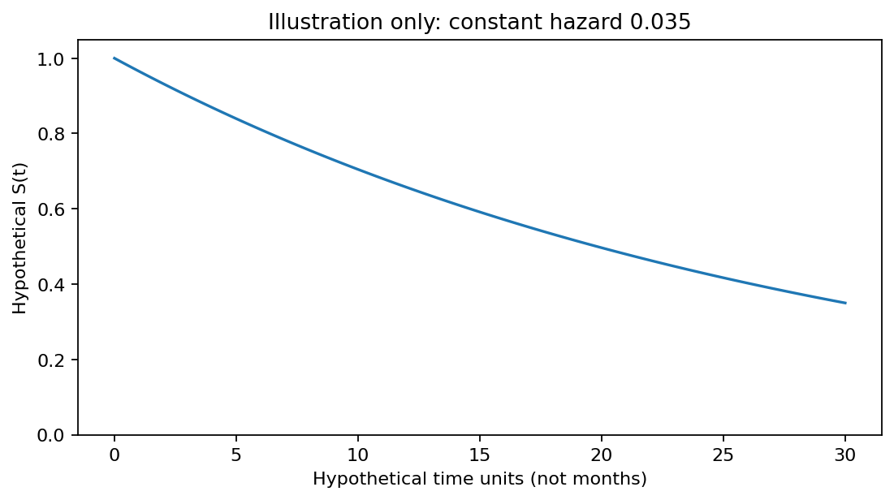

# Credit-card Churn: Full Pipeline Report

Procedure: [Customer_Churn_Practice.pdf](Customer_Churn_Practice.pdf), pages 2-24.
This is the completed credit-card case. The separate e-commerce case is not included.
All numerical findings below are generated by `churn_pipeline.py` from the local data.

## Decision and measured performance

Selected **numeric_control** by mean training cross-validation average precision (AP).
Validation selected threshold **0.253016** by minimizing
`5 * false negatives + 1 * false positives`.
Equal-cost thresholds prefer fewer flags. Costs are teaching units, not verified money.
The earlier top-10% contact scenario is superseded by this practice cost rule.
Selected parameters: `{"model__max_depth": null, "model__max_features": "sqrt", "model__min_samples_leaf": 2}`.

| Model | Training CV AP | Test AP | Test recall | Test precision | Test cost |
|---|---:|---:|---:|---:|---:|
| weighted_full | 0.9385 | 0.9396 | 90.46% | 81.67% | 221 |
| numeric_control | 0.9462 | 0.9464 | 93.54% | 76.77% | 197 |
| adasyn_numeric | 0.9408 | 0.9453 | 94.15% | 75.37% | 195 |

Model selection was frozen before validation threshold selection and test scoring.
Test comparisons are descriptive and do not trigger reselection. CV estimates are
selection scores, not unbiased generalization estimates.

- Selected test ROC-AUC: **0.9859**; Brier score: **0.0337**.
- Test F1: **0.8433**; accuracy: **94.42%**.
- Test prevalence / constant-score AP baseline: **16.04%**.
- AP bootstrap 95% interval: **[0.9289, 0.9632]**, using 500 customer resamples.
  This conditions on the fitted model and split; it does not capture retraining or temporal uncertainty.
- Confusion matrix: TN **1609**, FP **92**, FN **21**, TP **304**.
- Customers flagged: **396 / 2026**.
- Always-stay test cost: **1625**; always-flag cost: **1701**.
  Classification cost reduction is not measured campaign profit or causal retention lift.




## Practice steps and problems

| Practice pages | Implementation / finding | Status |
|---|---|---|
| 2-4: architecture and integrity | 10,127 rows, 0 missing cells; Unknown remains explicit; IDs unique | Complete |
| 5-7: activity, inactivity, relationships | Seven training-derived activity quantile bins; group rates and counts exported | Complete; sparse groups are descriptive |
| 8: preprocessing | Drop ID and both target-derived outputs; numeric median/scale; categorical mode/one-hot; fit inside CV | Complete |
| 9: features | Average ticket and contact ratio use denominator floor 1 | Complete; timing remains unverified |
| 10-11: model and search | 6,076 train / 2,025 validation / 2,026 test; three folds; 12 configurations; 150 trees | Complete |
| 12-14: ranking, costs, calibration | AP/ROC, validation-only threshold, held-out confusion matrix and reliability diagram | Complete; no test-fitted recalibration |
| 15-22: TreeSHAP | Frozen selected forest; grouped dummy contributions; beeswarm, dependence, local waterfall | Complete; associations are not interventions |
| 23: survival | Hypothetical illustration reproduced; event origin, event time, censoring, and feature availability dates absent | Empirical survival blocked by missing data |
| 24: retention action | Experiment and launch gates below | Proposal only; treatment evidence absent |

Split seed **42** is a local reproducibility choice. We match the practice
procedure, not its reported fitted outputs: its complete software environment and
split assignment are not provided. Source SHA-256: `c91b525a2a6755a1b0b80dad1d0d008ca97ec4df34552c8f47ffa12b6184b779`.
Split membership is saved before EDA. Validation and test rows are never resampled.



- **Total_Trans_Ct:** highest observed rate 47.82% in group `(36.0, 47.0]` (n=872); lowest 0.70% in `(87.0, 139.0]` (n=852).
- **Months_Inactive_12_mon:** highest observed rate 44.44% in group `0` (n=18); lowest 4.11% in `1` (n=1,339).
- **Total_Relationship_Count:** highest observed rate 29.15% in group `2` (n=717); lowest 10.42% in `6` (n=1,113).

These training associations are hypotheses for service review. In particular,
small inactivity groups should not define an intervention trigger without further
evidence. Bins are fitted locally on training data and need not match slide bins.

## ADASYN comparison and its boundary

`weighted_full` follows the practice with balanced class weights and all predictors.
`numeric_control` and `adasyn_numeric` share the same numeric features, tuning grid,
unweighted forest, and CV folds; the latter adds fold-local ADASYN after imputation
and scaling. This paired comparison separates oversampling from dropping categories.
Full-feature versus numeric-only results cannot isolate the effect of ADASYN alone.

No categorical interpolation or SMOTE is used. Numeric interpolation still creates
fractional counts and may break algebraic relationships between ratios and parent
features; these are synthetic model-space points, not real customer profiles.
ADASYN can emphasize noisy boundaries. Calibration and held-out performance are
therefore reported; selection is empirical rather than assuming oversampling helps.
See [imbalanced-learn oversampling guidance](https://imbalanced-learn.org/stable/over_sampling.html).

## Explainability

Exact path-dependent TreeSHAP explains churn probability for **251**
test customers: a seeded random sample plus the highest-risk test customer, chosen
without its true label. Largest mean absolute grouped attribution:
**Total_Trans_Ct**, **9.21 percentage points**.

The model reference is **16.07%**, reflecting stored
training-path weights, including any class weighting or resampling. It is not
automatically the population churn rate. Local example `719073483`
has predicted risk **100.00%**. Baseline plus contributions
reconstructs predicted probabilities; maximum error **3.11e-15**.
Grouping one-hot columns preserves the sum but does not define a new coalition game.
Correlated inputs can share credit. Colors compare values within each numeric feature;
categorical values are purple. Findings describe model reliance, not causal drivers.
See [TreeExplainer documentation](https://shap.readthedocs.io/en/stable/generated/shap.TreeExplainer.html).





## Survival illustration only

To reproduce page 23's teaching concept, plot `S(t) = exp(-hazard * t)` using an
assumed constant hazard of **0.035** per hypothetical time unit.
This parameter is supplied through `--illustrative-hazard`, not estimated from
customers. The curve is not empirical survival, a monthly retention forecast, or
an input to CLV. Event and censoring dates are still required for a real study.



## Retention proposal and unresolved gates

1. Verify feature cutoff times and the definition/date of churn; validate the frozen
   pipeline on an independent future cohort before treating scores as prospective risk.
2. Review eligible active accounts for disengagement and service friction. Historical
   test predictions are evaluation records, not an authorized live contact list.
3. Randomize eligible customers to a defined service/contact action or control.
   Pre-register horizon, minimum meaningful lift, sample size, exclusions, and stop rule.
4. Measure incremental retained contribution after handling and incentive costs.
   Transaction spend is not bank margin; no CLV, survival curve, or ROI is inferred here.
5. Monitor missingness, feature drift, calibration, recall, contact capacity, and
   subgroup outcomes. `subgroup_metrics.csv` reports Gender and Income_Category
   performance with denominators; these descriptive checks do not certify fairness.
   Pause rollout if timing, future-validation, or positive incremental-value gates fail.

## Reproduce and inspect

```bash
w9/.venv/bin/python w9/analyze.py
w9/.venv/bin/python w9/test_analyze.py
w9/.venv/bin/python w9/test_pipeline.py
w9/.venv/bin/python w9/churn_pipeline.py --seed 42 --fn-cost 5 --fp-cost 1 --illustrative-hazard 0.035
```

`requirements.txt` records package versions used. `outputs/pipeline_metrics.json`
records configuration, versions, audit, model choices, evaluation, and SHAP checks.
Other outputs include split assignments, all CV trials, validation threshold curves,
test predictions, subgroup metrics, calibration bins, and grouped SHAP contributions.
`outputs/churn_model.joblib` contains the fitted pipeline and threshold and was
reloaded to verify identical predictions. For scoring, apply `features(raw_rows)`
before its pipeline; do not refit preprocessing or use the target as an input.
Only load model artifacts you trust. The local model and virtual environment are ignored by Git.
